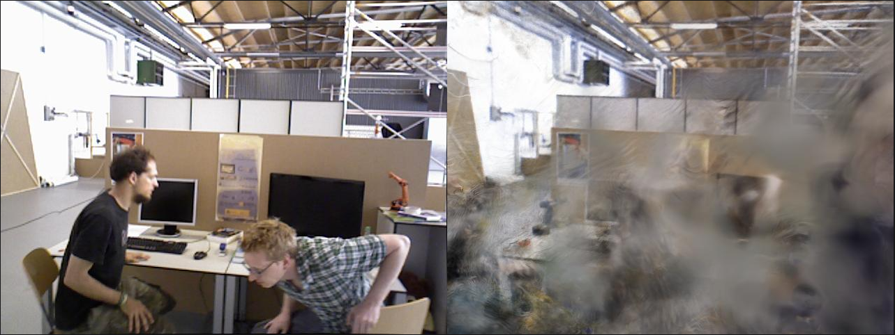
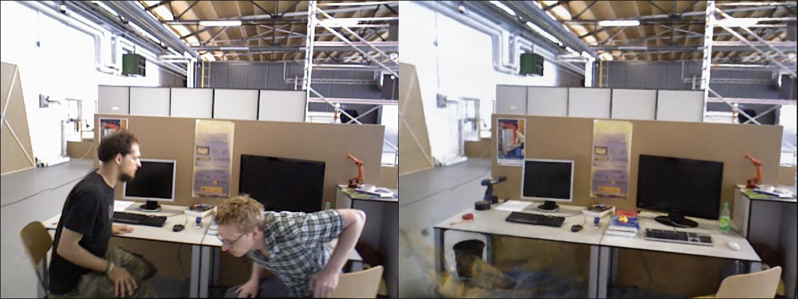
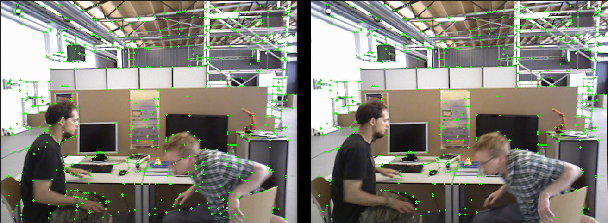
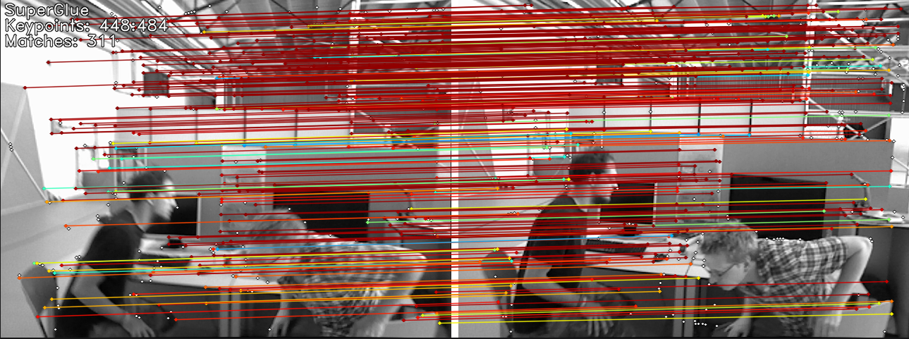

# NeRF in Dynamic Environments

This repository contains an implementation of the Neural Radiance Fields (NeRF) algorithm for dynamic environments.

## Introduction

Neural Radiance Fields (NeRF) is a novel approach that models a scene as a continuous 3D function which can be rendered from novel viewpoints. However, it's important to note that the original NeRF algorithm is not designed to dynamic scenes where objects move over time. This implementation serves as a basic adaptation attempt to extend NeRF's capabilities to dynamic environments.


### Before

### After


## Installation

1. Clone repository
   ```bash
   git clone git@github.com:ks-7-afk/nerf_in_dynamic.git
   cd nerf_in_dynamic
   ```
2. Install dependences
   ```bash
   conda env create -f environment.yaml
   conda activate dynamic_nerf
   pip install torch 
   ```
## Preprocessing Data with SuperPoint and SuperGlue

For preprocessing data, we use SuperPoint and SuperGlue. SuperPoint is used for detecting keypoints and descriptors, while SuperGlue is used for matching these points between images. Additionally, masking is applied to filter out irrelevant keypoints.
```bash
python -m preparation_data.prep_data \
    --dataset-dir /dataset/tum-rgbd/rgbd_dataset_freiburg3_walking_halfsphere \
    --vid-ids rgb \
    --run-sfm \
    --write-json \
    --vis \
    --masks
```
Images are located in the following directory structure:

```bash
/dataset/
└── tum-rgbd/
    └── rgbd_dataset_freiburg3_walking_halfsphere/
        └── rgb/
            ├── image1.png
            ├── image2.png
            ├── ...
```


Masking to filter out irrelevant keypoints.

## Training
To train the model, run the following command:
```bash
   ns-train nerfacto \
        --output-dir $OUTPUT_DIR \
        --data dataset/tum-rgbd/rgbd_dataset_freiburg3_walking_halfsphere/rgb \
        --viewer.quit-on-train-completion True \
        --pipeline.datamanager.camera-optimizer.mode off

```
--output-dir: Specifies the directory where the training outputs (model, logs, etc.) will be saved.

--data: Path to the directory containing the RGB images for training.
## Evaluate
To evaluate the trained model, run the following command:
```bash
 ns-eval \
--load-config $OUTPUT_DIR/config.yml \
--output-path output.json \
--render-output-path $OUTPUT_RENDER
```
--load-config: Path to the configuration file in $OUTPUT_DIR.

--output-path: Path to save the evaluation metrics in a JSON file (PSNR, SSIM, LPIPS).

--render-output-path: Path to save the rendered output image.

<table>
    <tr>
        <th>Method</th>
        <th>PSNR (↑)</th>
        <th>SSIM (↑)</th>
        <th>LPIPS (↓)</th>
    </tr>
    <tr>
        <td>NeRF</td>
        <td>18.086</td>
        <td>0.713</td>
        <td>0.294</td>
    </tr>
    <tr>
        <td>NeRF + Masking + Robust loss</td>
        <td>19.388</td>
        <td>0.780</td>
        <td>0.201</td>
    </tr>
       <tr>
        <td>NeRF + Masking + Robust loss + Filter out irrelevant keypoints</td>
        <td>19.577</td>
        <td>0.792</td>
        <td>0.198</td>
    </tr>
</table>


